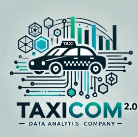

  <!-- Imagen inferior derecha -->
  
  <!-- Imagen inferior izquierda (20% más grande) -->
  

# Introducción
Somos una consultora de Data Science enfocada en el análisis estadístico de datos, desarrollo de modelos de machine learning y visualizaciones gráficas.

Consultora data se enfoca en establecer objetivos de negocios para obtener así estrategias que promuevan la optimización de rendimientos a corto, mediano y largo plazo, como también mostrar propuestas de mejora mediante el uso de modelos predictivos y visualizaciones. 

Nuestra consultora cuenta con un board, el cual está encargado de abordar los proyectos y negocios. 

Para garantizar la excelencia en nuestros servicios, nuestro equipo está compuesto por especialistas con roles claramente definidos, que abordarán los objetivos propuestos anteriormente por la empresa:
- Analista de Datos: Julian Ariel Burastero, Francisco Fajardo
Responsable de la limpieza, integración y preprocesamiento de datasets.
- Especialista en Visualización de Datos: Julian Ariel Burastero,
Diseña dashboards interactivos, mapas de calor y gráficos que transforman datos complejos en información comprensible para los clientes.
- Ingeniero de Machine Learning: Gabriel Arturo Monzon Luna, Jerónimo Martinez
Desarrolla modelos predictivos y optimiza algoritmos para correlaciones clave 
- Data Engineer: Ivan Lopez-Francisco Fajardo
Diseñar, desarrollar y mantener sistemas que procesan grandes cantidades de datos (Big Data), a través de base de datos relacionales y no relacionales, o en la nube.
- Gerente de Proyecto: Jerónimo Martinez
Coordina las tareas del equipo, gestiona los entregables y asegura 
la alineación con los objetivos del cliente.

# Contexto de negocio
Taxicom 2.0 es una empresa de taxis estadounidense que quiere expandir su negocio en la ciudad de New York para el segundo semestre de 2025. La empresa es consciente de que la tecnología y la ciencia de datos es crucial para la supervivencia y éxito de dicho proyecto frente a la competencia y las demandas sociales. Para ello Taxicom 2.0 decide contratar a nuestra consultora a fin de emplear nuestros servicios en base a sus objetivos. 

- Objetivos de negocio
Optimizar la logística y operación del transporte mediante análisis detallado de patrones de movilidad.
Evaluar el impacto ambiental del transporte y proponer soluciones hacia una transición sostenible.
Mejorar la experiencia del cliente identificando puntos críticos como tiempo, costo, y satisfacción (propinas).
Generar estrategias económicas basadas en la elasticidad de demanda, precios y eficiencia operativa.
- Servicios requeridos de la empresa TaxiCom 2.0

La empresa Taxicom 2.0 se dispone a contratar un conjunto de servicios personalizados en base a sus objetivos:  

+ Análisis de Demanda y Logística:
	- Identificación de zonas y horarios de alta demanda.
	- Optimización de rutas basadas en patrones de congestión y tiempo promedio de viaje.
	- Mapas dinámicos para la planificación de horarios pico.
+ Monitoreo de Impacto Ambiental:
	- Modelos predictivos que correlacionen calidad del aire (AQI) con cantidad de viajes.
	- Evaluación de la transición a vehículos eléctricos comparando emisiones y costos operativos.
+ Estudios de Satisfacción del Cliente:
	- Análisis de propinas promedio por zona como indicador de calidad.
	- Propuestas para implementar soluciones tecnológicas (pagos digitales, apps).
+ Correlaciones Climáticas y Operativas:
	- Evaluación del impacto del clima (lluvia, temperatura) en la movilidad urbana.
	- Ajuste de estrategias para condiciones climáticas extremas.

# Análisis Exploratorio de los datos (EDA)

El EDA se realizó en base a los dataset provistos por la empresa y en base a los que visualizamos como relevantes para el negocio. Cada link que se ve a continuación abre el EDA de cada data set trabajado y analizado:
- AlternativeFuelVehicleUS
- Contaminación o3, Pm2.5
- contaminacion_sonora_CO2
- ElectricCarData_Clean
- ElectricCarData_Norm
- FuelEconomy
- Lighr duty vehicles
- taxis_amarillos
- taxis_verdes
- Zonastaxi

# KPI propuestos a la empresa

Un KPI es un indicador clave de desempeño, es decir, es una métrica utilizada para medir y evaluar el rendimiento de una actividad, proceso o estrategia en relación con un objetivo específico en el tiempo. En base a estos indicadores la empresa puede tomar decisiones y monitorear los procesos. 

1. Inclusión de autos eléctricos. 
El KPI en este caso mide el progreso en la inclusión de autos eléctricos en función de un objetivo predeterminado (por defecto, 1000 autos). El cálculo genera un porcentaje que permite visualizar cuánto se ha avanzado hacia la meta.

	- Fórmula del KPI para el cliente:
	Progreso de Inclusión (%) = (Número de autos eléctricos integrados/ objetivo total de autos eléctricos) x 100

	- Explicación para el cliente:
	Número de autos eléctricos integrados: Es el número actual de autos eléctricos incorporados en la flota.
	Objetivo total de autos eléctricos: Es la meta establecida para integrar autos eléctricos, por defecto 1000.
	El resultado se expresa en porcentaje, mostrando cuánto se ha avanzado hacia el objetivo.

2. Reducir las Emisiones de CO2 en un 10%
Este KPI mide el progreso hacia el objetivo de reducir las emisiones de CO2 en un 10% respecto a su valor inicial. Permite evaluar si las estrategias implementadas para reducir emisiones son efectivas y cuán cerca estamos de alcanzar la meta.

	- Fórmula para el cliente:
	Reducción de CO2 (%) =  (Emisiones iniciales - Emisiones actuales/emisiones iniciales) x 100

	- Componentes de la Fórmula:
	Emisiones iniciales: El nivel de emisiones de CO2 antes de implementar las estrategias de reducción.
	Emisiones actuales: El nivel de emisiones de CO2 después de implementar las estrategias.
	El resultado expresa el porcentaje de reducción logrado respecto al valor inicial.

3. Reducción de Tiempo Muerto (%)
Este KPI mide el progreso en la reducción del tiempo muerto (o inactivo) de los taxis, es decir, el tiempo que pasan sin pasajeros mientras esperan una solicitud. Es clave para optimizar la operación y la rentabilidad del servicio, así como para disminuir el impacto ambiental.

	- Fórmula para el cliente:
	Reducción de tiempo muerto = (Tiempo muerto inicial- Tiempo muerto actual / Tiempo muerto inicial) x 100

	- Componentes de la Fórmula:
	Tiempo muerto inicial: El tiempo promedio que los taxis pasan inactivos por turno antes de implementar mejoras (en minutos u horas).
	Tiempo muerto actual: El tiempo promedio que los taxis pasan inactivos por turno después de implementar mejoras.
	Resultado: Indica en porcentaje cuánto se ha reducido el tiempo muerto respecto al punto de partida.

4. Aumentar los ingresos de pasajeros en un 2% de taxis amarillos
Objetivo: Incrementar los ingresos totales generados por los viajes en un 2% en el próximo trimestre.

	- Fórmula:  (Ingresos actuales - Ingresos previos / Ingresos previos) × 100 

	- Medición:
	Ingresos actuales: Total de la columna total_amount para el período actual.
	Ingresos previos: Total de la columna total_amount para el período de comparación (mes o trimestre anterior).

5. Reducir la duración promedio de los viajes en un 5% de taxis amarillos
Objetivo: Disminuir la duración promedio de los trayectos para mejorar la eficiencia operativa y reducir el tiempo muerto.

	- Fórmula:(Duración previa - Duración actual) / Duracioón previa×100

	- Medición:
	Duración promedio previa: Promedio de la diferencia entre tpep_pickup_datetime y tpep_dropoff_datetime para el período anterior.
	Duración promedio actual: Promedio de la misma métrica para el período actual.

6. Incrementar la ocupación promedio de pasajeros en un 3% de taxis amarillos
Objetivo: Aumentar el número promedio de pasajeros por viaje en un 3% para maximizar la capacidad utilizada.

	- Fórmula:(Ocupación actual - Ocupación previa) / Ocupación previa×100

	- Medición:
		Ocupación promedio actual: Promedio de la columna passenger_count en el período actual.
		Ocupación promedio previa: Promedio de la misma columna en el período anterior.

